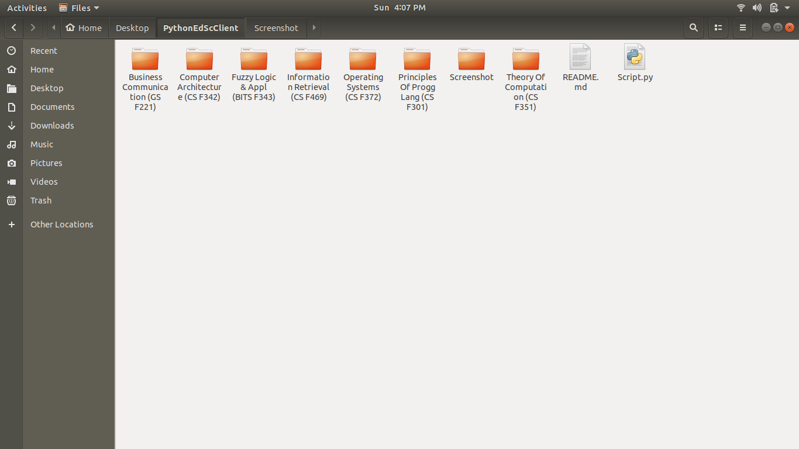
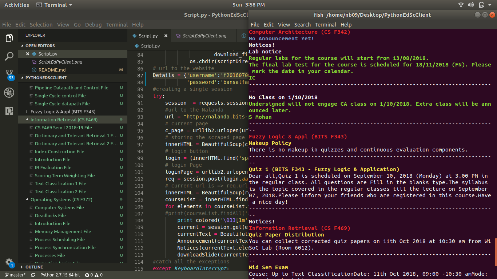

#User Guide
## Clone the Directory on your Desktop using the command  
    git clone https://github.com/NavjotBansal/PythonEdScClient.git
## if you dont have pip install it by typing
    sudo apt install python-pip
## Using PIP install the following Packages 
    pip install colored 
    pip install beautifulsoup4
    pip install requests.
## After Cloning open Script.py And find Details  
### Update the username and password of the Details as your own email-id and password for portal login
### Open terminal in this folder and type 
    python Scripyt.py
## Finds Courses on its own
 

## The script has the aim to automate the tideous task of looking for slides and announcements and downloading them

### The Annoncements and the Notice Sections are shown in the terminal only 

